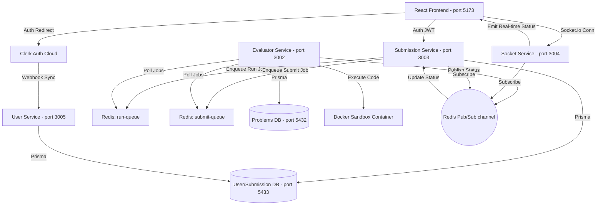

# Codexis: Distributed Microservices Online Judge Platform

Codexis is a real-time, secure, and distributed Online Judge platform (similar to LeetCode) built using a microservices architecture. It evaluates and compiles untrusted user code safely inside isolated Docker sandbox containers and streams execution progress in real time via WebSockets.

---

## 🚀 Key Features

* **Real-time Evaluation Logging**: Status updates (`PENDING`, `RUNNING`, `ACCEPTED`, `WRONG_ANSWER`, etc.) are streamed instantly to the browser using Socket.io.
* **Secure Code Sandboxing**: Spawns isolated Docker containers with strict memory limits and execution timeouts to prevent host system damage.
* **Dual Database Split**: Separates read-heavy problems metadata (`postgres_static` on port `5432`) from write-heavy users/submissions data (`postgres_user` on port `5433`).
* **Dual-Queue Execution Model**: decoples and processes trial runs (runs only sample test cases in-memory, bypassing database writes) and final submissions (runs all test cases, persists solution state) via Redis and BullMQ.
* **Third-Party Authentication**: Integrates secure authentication using Clerk, automatically synchronizing user data via real-time SVIX Webhooks.
* **BullMQ Dashboard**: Visualizes execution queues (`run-queue` and `submit-queue`) in real-time.

---

## 🛠️ System Architecture



---

## ⚡ Getting Started & Setup

### Prerequisites
Make sure you have the following installed:
* [Docker Desktop](https://www.docker.com/products/docker-desktop/)
* [Node.js (v18+)](https://nodejs.org/)

---

### Step 1: Clone and Spin Up Databases & Redis (Docker)
We use Docker Compose to spin up our multi-database architecture and Redis message broker.

Run the following command at the root directory of the project:
```bash
docker-compose up -d
```
This starts:
1. `postgres_static` on port `5432` (Problems DB)
2. `postgres_user` on port `5433` (Users/Submissions DB)
3. `redis` on port `6379` (BullMQ Message Broker)

To check if the containers are running:
```bash
docker ps
```

---

### Step 2: Setup Database Schemas & Seed Data

1. **Seed the Problems Database** (`Codexis_Problem_Admin_Service`):
   ```bash
   cd Codexis_Problem_Admin_Service
   npm install
   npx prisma db push
   npm run seed
   ```
2. **Setup the Submissions/Users Schema** (`Codexis_Submission_Service`):
   ```bash
   cd ../Codexis_Submission_Service
   npm install
   npx prisma db push
   ```
3. **Setup the User Profile Database Sync** (`Codexis_User_Service`):
   ```bash
   cd ../Codexis_User_Service
   npm install
   npx prisma db push
   ```

---

### Step 3: Run the Microservices

You need to run the backend microservices and the frontend dev server. Run `npm install` and `npm run dev` in each of their directories:

| Directory | Service Name | Default Port | Description |
| :--- | :--- | :--- | :--- |
| `Codexis_Problem_Admin_Service` | Problem Admin API | `3001` | Handles problems metadata. |
| `Codexis_Evaluator_Service` | Code Evaluator / Workers | `3002` | Runs BullMQ workers and sandboxes. |
| `Codexis_Submission_Service` | Submission API Gateway | `3003` | Receives runs and final submissions. |
| `Codexis_Socket_Service` | WebSocket Broker | `3004` | Streams real-time execution updates. |
| `Codexis_User_Service` | User Management API | `3005` | Syncs profile events via Clerk webhooks. |
| `frontend` | Vite + React Application | `5173` | The main user coding IDE dashboard. |

---

## 🔒 Security & Code Sandbox Details

The platform secures the host machine by compiling and executing code inside runtimes with:
* **Time limits**: Configured dynamically per problem (default: `2000ms`).
* **Memory constraints**: Docker limits the RAM available to each child container.
* **Strict Network isolation**: Sandbox containers are launched with network access disabled (`network: none`) to prevent malicious outbound internet calls.
