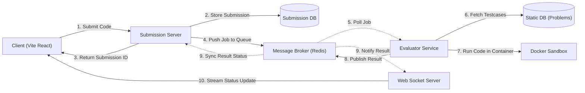

# Codexis: Distributed Microservices Online Judge Platform

Codexis is a real-time, secure, and distributed Online Judge platform (similar to LeetCode or CodeWar) built using a microservices architecture. It evaluates and compiles untrusted user code safely inside isolated Docker sandbox containers and streams execution progress in real time via WebSockets.

Codexis follows a microservices architecture with the following core services:

* **Submission Service**: Handles user code runs and final submissions.
* **Evaluator Service**: Polls jobs from Redis queues, pulls problem details, and runs execution sandboxes.
* **Socket Service**: Manages WebSocket connections to relay job updates to the client in real-time.
* **User Service**: Synchronizes user accounts and manages profiles.
* **Problem Admin Service**: Handles administration of coding problems and test cases.

---

## System Flow Diagram



The above diagram illustrates the complete flow of how services interact:

1. **Client** submits code solution to **Submission Server**.
2. **Submission Server** stores the submission metadata and sets the initial status to `PENDING` in the **Submission DB** (skipped for in-memory trials/run-only executions).
3. **Submission Server** returns the generated unique **Submission ID** back to the **Client** immediately.
4. **Submission Server** pushes the job payload containing the code and metadata to the **Message Broker (Redis Queue)**.
5. **Evaluator Service** polls and picks up the job from the queue.
6. **Evaluator Service** queries the **Static DB** to fetch the problem's time limits, memory limits, and test cases.
7. **Evaluator Service** executes the code against the test cases inside a secure, isolated **Docker Sandbox container**.
8. **Evaluator Service** publishes the execution outcomes (pass/fail status, execution time, memory usage, error logs) back to the **Message Broker (Redis Pub/Sub)**.
9. **Message Broker** broadcasts the results:
   * It notifies the **Web Socket Server** about the completion state.
   * It notifies the **Submission Server** which updates the final status in the **Submission DB**.
10. **Web Socket Server** streams the execution status update in real-time back to the **Client**.

---

## ⚡ Getting Started & Setup

### Prerequisites
Make sure you have the following installed:
* [Docker Desktop](https://www.docker.com/products/docker-desktop/)
* [Node.js (v18+)](https://nodejs.org/)

---

### Step 1: Spin Up Databases & Redis (Docker)
We use Docker Compose to spin up our database systems and Redis message broker.

Run the following command at the root directory of the project:
```bash
docker-compose up -d
```
This starts:
1. `postgres_static` on port `5432` (Problems DB)
2. `postgres_user` on port `5433` (Users/Submissions DB)
3. `redis` on port `6379` (BullMQ Message Broker / Pub/Sub)

---

### Step 2: Setup Database Schemas & Seed Data

1. **Seed the Problems Database** (`Codexis_Problem_Admin_Service`):
   ```bash
   cd Codexis_Problem_Admin_Service
   npm install
   npx prisma db push
   npm run seed
   ```
2. **Setup the Submissions/Users Schema** (`Codexis_Submission_Service`):
   ```bash
   cd ../Codexis_Submission_Service
   npm install
   npx prisma db push
   ```
3. **Setup the User Database** (`Codexis_User_Service`):
   ```bash
   cd ../Codexis_User_Service
   npm install
   npx prisma db push
   ```

---

### Step 3: Run the Microservices

Navigate into each directory, run `npm install`, and start the service in development mode:

| Directory | Service Name | Port | Description |
| :--- | :--- | :--- | :--- |
| `Codexis_Problem_Admin_Service` | Problem Admin API | `3001` | Manages problem statements & test cases. |
| `Codexis_Evaluator_Service` | Code Evaluator / Workers | `3002` | Runs BullMQ workers and sandbox managers. |
| `Codexis_Submission_Service` | Submission API Gateway | `3003` | Entry point for run & submit code calls. |
| `Codexis_Socket_Service` | WebSocket Service | `3004` | Handles client connection rooms for streaming. |
| `Codexis_User_Service` | User Management API | `3005` | Syncs user accounts. |
| `frontend` | React UI | `5173` | Code editor and submissions history panel. |

---

## 🔒 Sandbox Security Constraints

Untrusted user code runs in isolated environments with:
* **Execution Timeouts**: Stops infinite loops (e.g. `while(true)`) automatically based on problem configuration.
* **Memory Limits**: Restricts memory usage to prevent system exhaustion.
* **Network Isolation**: Sandbox containers have network capabilities disabled (`network: none`) to prevent outbound communication.
